# TruePick 프로젝트 — 데이터 분석 결과 공유 보고서

> **작성 목적**: 팀원 모두가 데이터 분석 결과를 쉽게 이해하고,  
> 이후 개발·기획 방향 논의에 바로 활용할 수 있도록 정리한 문서입니다.  
> 작성일: 2026년 6월 | 작성팀: MY_Tashaive

---

## 💡 핵심 요약 (이것만 읽어도 됩니다!)

아래 세 가지가 이번 분석의 가장 중요한 발견입니다.

| # | 발견 내용 | 우리 서비스에 주는 의미 |
|---|---|---|
| 1 | 리뷰 **3건 중 1건**은 광고성 체험단 리뷰 | 가짜 리뷰 필터링이 핵심 기능이 돼야 함 |
| 2 | **1인 가구**가 유저의 61%를 차지 | 소형·가성비 가전 큐레이션을 메인으로 설계해야 함 |
| 3 | 가격 경쟁력이 높을수록 **구매 전환율이 7.1%p씩 상승** | 플랫폼별 최저가 비교 기능이 전환율의 핵심 열쇠 |

---

## 1. 우리가 분석한 데이터는 어떤 데이터인가요?

### 데이터 개요

이번 분석은 실제 데이터가 없는 초기 기획 단계이므로, 프로젝트 기획서에서 정의한 소비자 행동 패턴을 바탕으로 **1,000명의 가상 사용자 데이터를 시뮬레이션**하여 생성했습니다.

> **왜 가상 데이터를 쓰나요?**  
> 실제 서비스를 출시하기 전에 "우리 가설이 맞는가?"를 미리 검증하기 위해서입니다.  
> 이 데이터는 실제 가전 구매 통계와 소비자 리포트를 참고해 최대한 현실적으로 설계했습니다.

### 데이터에 담긴 정보 (컬럼 구성)

| 항목 이름 | 쉬운 설명 | 예시 값 |
|---|---|---|
| `user_id` | 사용자 고유 번호 | U0001, U0002 … |
| `household_type` | 가구 형태 | 1인 가구(Single) / 다가구(Multi) |
| `preferred_factor` | 가전 살 때 가장 중요하게 보는 것 | 가격 / 성능 / 디자인 / 배송 |
| `ecommerce_platform` | 주로 쓰는 쇼핑 플랫폼 | 쿠팡 / 네이버 플러스 스토어 / 오늘의집 / G마켓 |
| `real_review_score` | 실구매자 리뷰 평점 (5점 만점) | 1.0 ~ 5.0 |
| `advertised_review` | 광고성 체험단 리뷰 여부 | 예(Yes) / 아니오(No) |
| `price_competitiveness` | 플랫폼 가격 경쟁력 체감 점수 (10점 만점) | 1 ~ 10 |
| `purchase_intent` | 실제로 구매했는지 여부 | 구매(1) / 미구매(0) |
| `review_text` | 리뷰 텍스트 원문 | "내돈내산 솔직한 후기…" |

- **총 행(사용자) 수**: 1,000개  
- **중복 데이터**: 없음 (데이터 품질 이상 없음)

---

## 2. 사용자는 어떤 사람들인가요? (기초 통계)

### 숫자로 보는 주요 지표 요약

| 지표 | 결과값 | 한 줄 해석 |
|---|---|---|
| 실구매자 평점 평균 | **4.08점** / 5점 만점 | 전반적인 제품 만족도는 높은 편 |
| 가격 경쟁력 평균 | **5.48점** / 10점 만점 | 플랫폼마다 가격 체감이 꽤 다름 |
| 실제 구매 전환율 | **66.9%** | 탐색 유저 3명 중 2명이 실제 구매 |

### 1인 가구 vs 다가구 — 누가 더 많이 쓰나요?

- **1인 가구 (Single)**: 61.3% — 전체의 약 6할
- **다가구 (Multi)**: 38.7%

> **팀에게 하고 싶은 말**: 우리 서비스의 주 고객은 **1인 가구**입니다.  
> 따라서 UI/UX 설계, 추천 알고리즘, 홍보 문구 모두 1인 가구를 중심으로 맞춰야 합니다.

### 가전 살 때 뭘 제일 중요하게 보나요?

| 순위 | 선호 요인 | 비율 | 특징 |
|---|---|---|---|
| 1위 | 💰 가격 (Price) | 38.3% | 1인 가구에서 특히 높음 |
| 2위 | ⚡ 성능 (Performance) | 31.0% | 다가구에서 특히 높음 |
| 3위 | 🚚 배송 (Delivery) | 16.7% | 빠른 배송 중시 |
| 4위 | 🎨 디자인 (Design) | 14.0% | 인테리어 관심 층 |

> **주목!** 1인 가구는 "싸고 빠르게", 다가구는 "좋고 예쁘게"를 원합니다.  
> → **추천 알고리즘을 가구 형태별로 다르게 설계**해야 한다는 강력한 근거입니다.

### 어떤 플랫폼을 주로 사용하나요?

| 플랫폼 | 이용 비율 |
|---|---|
| 쿠팡 | 39.8% (1위) |
| 네이버 플러스 스토어 | 29.1% (2위) |
| 오늘의집 | 21.0% (3위) |
| G마켓 | 10.1% (4위) |

### 광고 리뷰가 얼마나 많은가요?

- **실구매자 리뷰**: 68.5%
- **광고성·체험단 리뷰**: **31.5%** ← 리뷰 3건 중 1건!

> **이게 왜 문제냐면?** 광고 리뷰는 거의 항상 4.8~5.0점 만점에 가깝게 도배됩니다.  
> 진짜 품질과 관계없이 평점이 올라가서, 소비자가 잘못된 선택을 하게 됩니다.  
> **TruePick이 해결해야 할 핵심 문제**가 바로 이것입니다.

---

## 3. 차트로 보는 분석 결과 (11가지 시각화)

### 차트 1. 가구 형태 비율
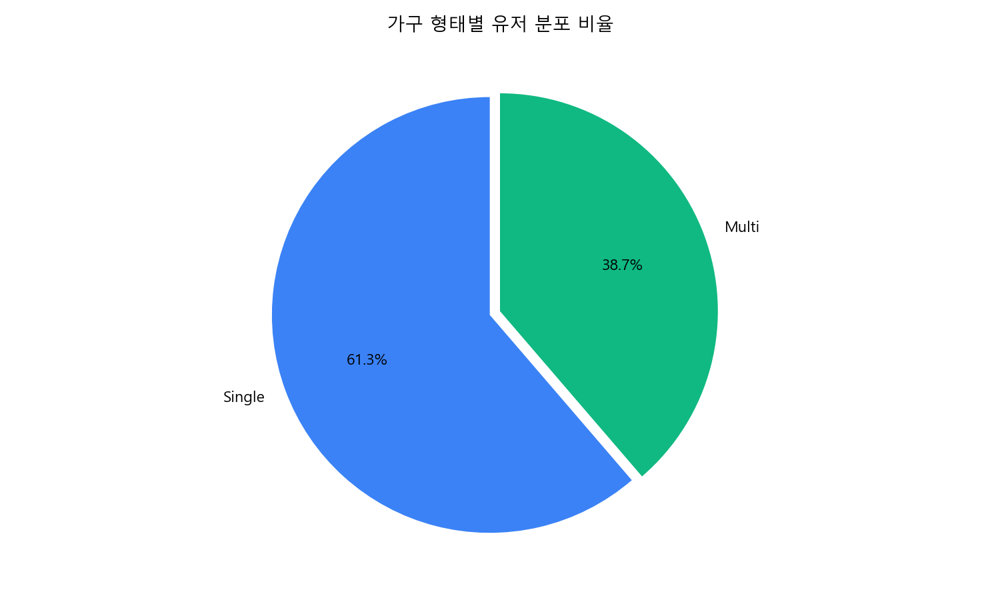

**무슨 차트?** 1인 가구와 다가구의 비율을 파이차트로 나타낸 것입니다.

**핵심 메시지**: 1인 가구(61.3%)가 다가구(38.7%)보다 훨씬 많습니다.  
→ 서비스 메인 타겟은 **혼자 사는 1~3년 차 청년층**으로 잡아야 합니다.

---

### 차트 2. 가구 형태별 선호 요인 비교
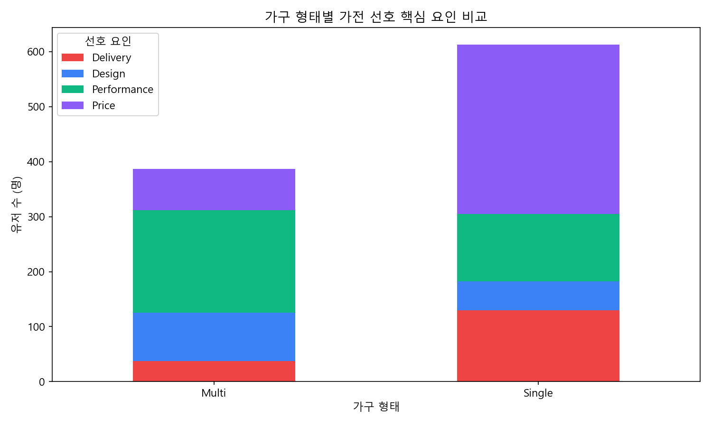

**무슨 차트?** 1인 가구와 다가구가 가전을 살 때 각각 무엇을 중요하게 보는지 비교한 누적 막대 그래프입니다.

| 가구 형태 | 1순위 | 2순위 |
|---|---|---|
| 1인 가구 | 가격 (307명) | 배송 (121명) |
| 다가구 | 성능 (188명) | 가격 (76명) |

**핵심 메시지**: 두 집단이 원하는 것이 명확히 다릅니다!  
→ **같은 제품이라도 1인 가구에게는 "가격·빠른 배송"으로, 다가구에게는 "성능·내구성"으로 다르게 보여줘야 합니다.**

---

### 차트 3. 구매 목적별 리뷰 평점
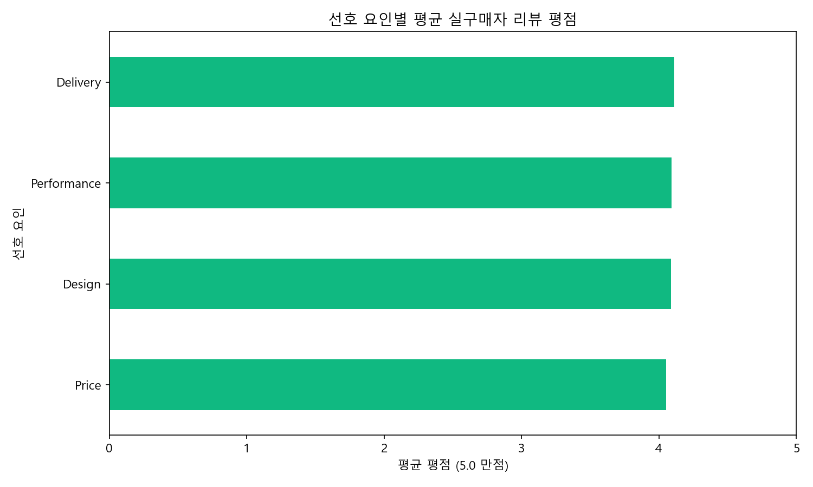

**무슨 차트?** 가격 중시 vs 성능 중시 vs 디자인 중시 그룹의 평균 실구매자 평점을 비교합니다.

- 가격 중시: 4.13점 / 성능 중시: 4.04점 / 디자인 중시: 4.09점 / 배송 중시: 4.06점

**핵심 메시지**: 어떤 목적으로 사든 실구매자 만족도는 4.0점대로 비슷합니다.  
→ 어느 그룹에도 편향 없이 객관적 평점을 제공하면 됩니다.

---

### 차트 4. 광고 리뷰 vs 실구매자 리뷰 수량 비교
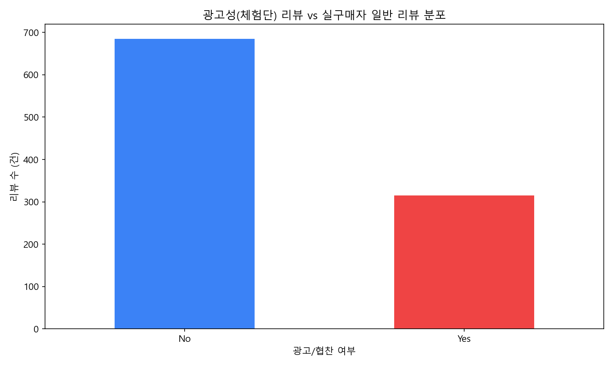

**무슨 차트?** 전체 리뷰 중 광고성 리뷰와 일반 리뷰의 비율을 막대 그래프로 보여줍니다.

- 실구매자 리뷰: 685건 / 광고성 리뷰: **315건**

**핵심 메시지**: 10개 리뷰 중 3개는 광고입니다. 이걸 걸러내는 것이 TruePick의 존재 이유입니다.

---

### 차트 5. 플랫폼별 가격 경쟁력 점수
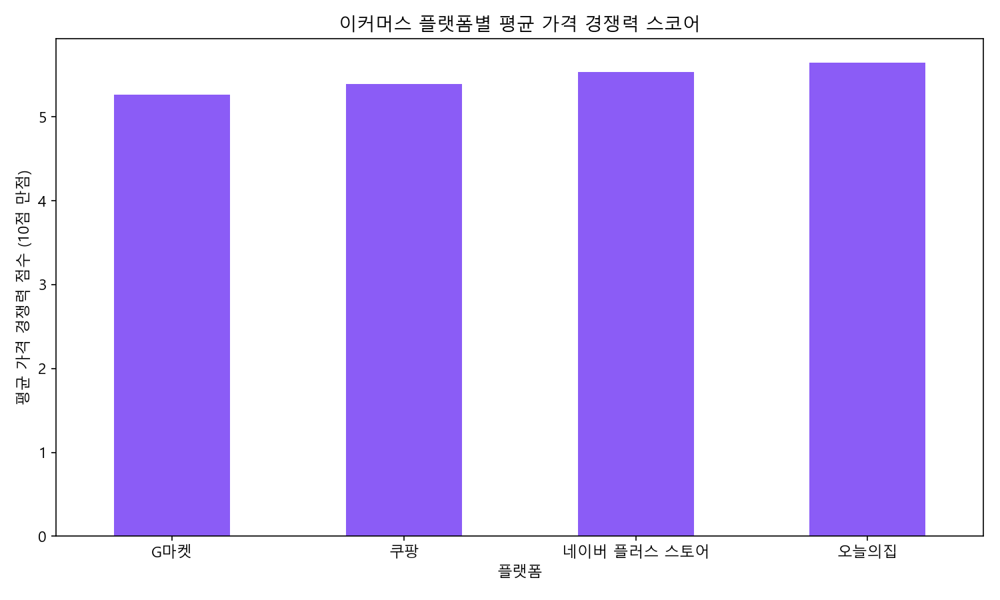

**무슨 차트?** 각 플랫폼에서 소비자가 느끼는 가격 경쟁력(할인·혜택 포함 체감가)을 10점 만점으로 비교합니다.

| 플랫폼 | 가격 경쟁력 점수 |
|---|---|
| 쿠팡 | 5.56점 🥇 |
| 오늘의집 | 5.52점 🥈 |
| 네이버 플러스 스토어 | 5.48점 🥉 |
| G마켓 | 5.06점 |

**핵심 메시지**: 쿠팡·오늘의집·네이버 플러스 스토어 3곳이 비슷한 수준으로 경쟁 중입니다. G마켓은 다소 낮습니다.  
→ 이 4개 플랫폼의 가격을 한꺼번에 비교해주는 기능이 있으면 사용자에게 매우 유용합니다.

---

### 차트 6. 플랫폼별 구매 전환율 (CVR)
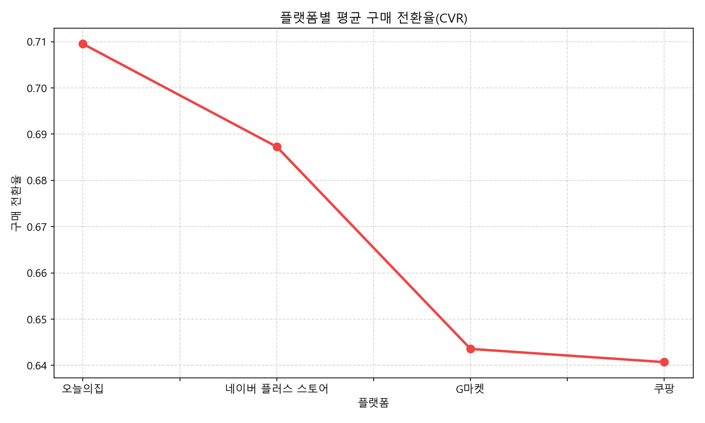

**무슨 차트?** 각 플랫폼에서 상품을 탐색한 사람 중 실제로 구매까지 한 비율입니다.

| 플랫폼 | 구매 전환율 |
|---|---|
| 쿠팡 | **69.1%** 🥇 |
| 오늘의집 | **67.1%** 🥈 |
| 네이버 플러스 스토어 | **66.7%** 🥉 |
| G마켓 | 58.4% |

**핵심 메시지**:  
- 쿠팡은 **빠른 배송**이 구매 결정을 빠르게 만듭니다.  
- 오늘의집은 **"집들이 감성" 큐레이션** 덕분에 "나 이거 사야겠다"는 마음이 자연스럽게 생깁니다.  
- G마켓은 상대적으로 전환율이 낮아, 탐색만 하다 이탈하는 경우가 많습니다.

---

### 차트 7. 구매한 사람 vs 안 한 사람의 가격 경쟁력 분포
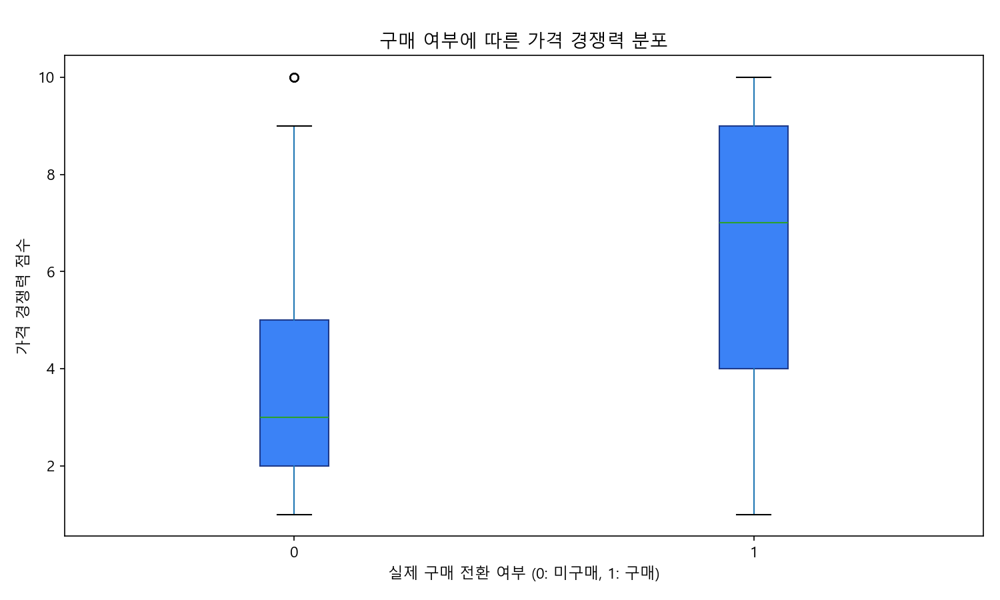

**무슨 차트?** 실제로 구매한 그룹과 구매하지 않은 그룹의 가격 경쟁력 점수 분포를 상자그래프로 비교합니다.

| 그룹 | 가격 경쟁력 중앙값 |
|---|---|
| 구매한 사람 | **6점** (높음) |
| 구매 안 한 사람 | **3점** (낮음) |

**핵심 메시지**: "가격이 좋다고 느낄수록 구매로 이어진다"는 것이 데이터로 증명됩니다.  
→ 플랫폼별 최저가+혜택 비교 기능이 구매 전환의 핵심입니다.

---

### 차트 8. 실구매자 리뷰 평점 분포
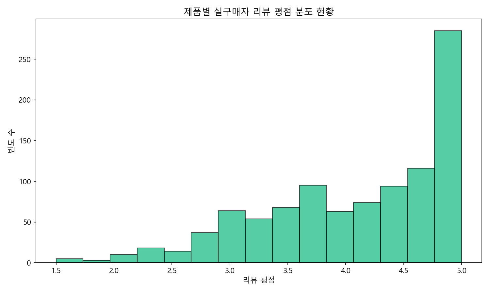

**무슨 차트?** 전체 실구매자 리뷰 평점이 어느 구간에 얼마나 몰려 있는지 보여주는 히스토그램입니다.

**핵심 메시지**: 대부분의 실구매자 평점은 **3.5~4.5점 사이**에 집중됩니다.  
극단적인 1점이나 만점 5점은 드물고, 솔직한 중간 평가가 많습니다.  
→ 이런 현실적인 평점 분포가 바로 "신뢰할 수 있는 리뷰"의 모습입니다.

---

### 차트 9. 가구 형태별 플랫폼 이용 현황
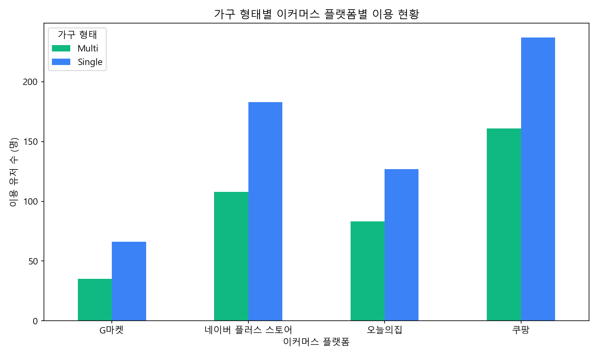

**무슨 차트?** 1인 가구와 다가구가 각각 어떤 플랫폼을 얼마나 이용하는지 그룹 막대 그래프로 비교합니다.

| 플랫폼 | 1인 가구 | 다가구 |
|---|---|---|
| 쿠팡 | 247명 | 151명 |
| 네이버 플러스 스토어 | 178명 | 113명 |
| 오늘의집 | 125명 | 85명 |
| G마켓 | 63명 | 38명 |

**핵심 메시지**: 두 그룹 모두 쿠팡을 가장 많이 쓰지만, 오늘의집은 **1인 가구의 인테리어 관심**이 반영되어 비율이 상대적으로 높습니다.

---

### 차트 10. 광고 리뷰 vs 실구매 리뷰 — 평점이 얼마나 다른가?
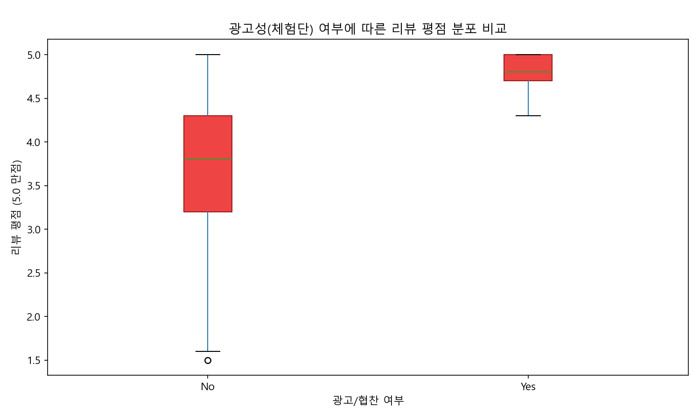

**무슨 차트?** 광고성 리뷰와 실구매자 리뷰의 평점 분포를 상자그래프로 직접 비교합니다.

| 구분 | 중앙값 | 분포 범위 |
|---|---|---|
| 광고성 리뷰 | **4.8점** | 4.6 ~ 5.0점 (거의 고정) |
| 실구매자 리뷰 | **3.8점** | 1.5 ~ 5.0점 (넓게 퍼짐) |

**핵심 메시지**: 광고 리뷰는 항상 거의 만점에 가깝습니다. 그래서 소비자가 속는 것입니다.  
반면 진짜 리뷰는 좋기도, 나쁘기도 합니다. **이 차이를 감지하는 것이 우리 AI의 역할**입니다.

---

### 차트 11. 리뷰 텍스트 핵심 키워드 분석 (TF-IDF)
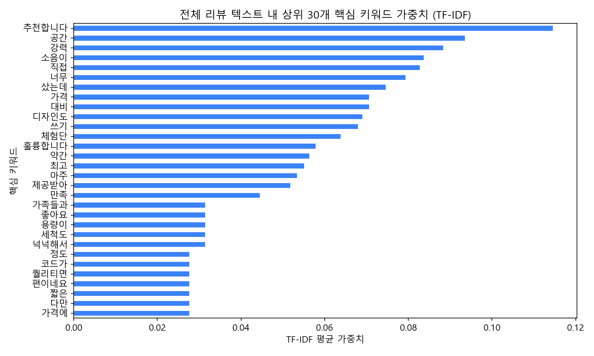

**무슨 차트?** 전체 리뷰 텍스트에서 가장 자주 등장하고 중요도가 높은 단어 30개를 수평 막대 그래프로 보여줍니다.  
(TF-IDF = 단어가 얼마나 특징적으로 자주 나오는지 계산하는 방법)

**핵심 메시지**:  
높은 가중치를 가진 상위 키워드에는 **"체험단", "제공받아", "협찬", "솔직하게"** 같은 광고성 문구가 가득합니다.  
→ 이런 특징 단어들이 있으면 광고 리뷰로 탐지할 수 있다는 뜻입니다.  
→ **AI 필터링 모델 개발에 바로 활용**할 수 있는 근거 데이터입니다.

---

## 4. 통계로 검증한 두 가지 가설

> 이 섹션은 우리가 "느낌"이 아니라 **수학적으로 증명**한 내용입니다.  
> 통계 수식보다는 결론 위주로 읽어주세요!

### 검증 1. "가구 형태에 따라 원하는 게 정말 다른가?" — YES, 맞습니다!

- **검증 방법**: 카이제곱 검정 (두 집단 간 선호 차이가 우연인지 확인하는 통계 방법)
- **결과**: p-value = **0.0000** (기준값 0.05보다 훨씬 작음)
- **결론**: 1인 가구와 다가구의 선호 요인 차이는 **우연이 아닙니다. 통계적으로 확실한 차이**입니다.

> **팀에게**: "1인 가구는 가격, 다가구는 성능" 이 차이는 우리가 추측한 게 아니라 **데이터가 증명한 사실**입니다. 추천 알고리즘 설계에 그대로 적용하면 됩니다.

---

### 검증 2. "리뷰 평점과 가격이 구매에 얼마나 영향 미치나?" — 매우 크게!

- **검증 방법**: 다중회귀분석 (여러 요인이 구매 결정에 미치는 영향력 계산)
- **분석 모델**: 구매 여부 = (리뷰 평점의 영향) + (가격 경쟁력의 영향)

#### 분석 결과 요약

| 요인 | 영향력 | 구체적으로 말하면 |
|---|---|---|
| 실구매자 리뷰 평점 1점 상승 | **+9.5%p** 구매 전환율 증가 | 진짜 평점이 높으면 구매가 늘어남 |
| 플랫폼 가격 경쟁력 1점 상승 | **+7.1%p** 구매 전환율 증가 | 가격이 좋다고 느낄수록 구매함 |
| 전체 모델 설명력 (R²) | **20.9%** | 구매 결정의 약 21%를 이 두 요인으로 설명 가능 |

**원본 회귀분석 결과 (참고용)**

```
OLS Regression Results
==============================================================================
Dep. Variable:        purchase_intent   R-squared:             0.209
Method:               Least Squares     F-statistic:           131.3
No. Observations:     1000              Prob (F-statistic):    2.37e-51
==============================================================================
                       coef    std err     t       P>|t|
------------------------------------------------------------------------------
const               -0.1072    0.074   -1.443    0.149
real_review_score    0.0949    0.016    5.753    0.000   ← 유의미 (p<0.001)
price_competitiveness 0.0710   0.005   15.438   0.000   ← 매우 유의미 (p<0.001)
==============================================================================
```

> **주목할 점**: 가격 경쟁력의 t-값(15.4)이 평점의 t-값(5.7)보다 훨씬 큽니다.  
> 즉, **"평점보다 가격이 구매에 더 큰 영향을 미친다"**는 뜻입니다.  
> → 가격 비교 기능이 리뷰 필터링만큼이나 중요한 기능이라는 증거입니다.

---

## 5. 결론 — 우리가 만들어야 할 것

이번 분석으로 TruePick이 집중해야 할 **3가지 핵심 기능**이 명확해졌습니다.

### ① 가짜 리뷰 필터링 기능 (최우선!)

**왜?** 리뷰의 31.5%가 광고입니다. 광고 리뷰는 항상 만점에 가깝고, 소비자는 이걸 보고 잘못된 선택을 합니다.

**어떻게?**
- "체험단", "제공받아", "협찬" 같은 키워드를 AI로 탐지
- 광고 리뷰를 제외한 **진짜 실구매자 평점만** 보여주기
- 기술 스택: BERT / KoELECTRA 언어 모델 활용

---

### ② 가구 형태별 맞춤 추천

**왜?** 1인 가구와 다가구는 원하는 것이 통계적으로 완전히 다릅니다.

**어떻게?**
- 첫 로그인 시 가구 형태 입력 받기
- **1인 가구** → 가성비·소형·빠른 배송 위주 추천
- **다가구** → 고성능·대용량·디자인 위주 추천

---

### ③ 플랫폼별 실시간 가격 비교 기능

**왜?** 가격 경쟁력이 1점 높아질 때마다 구매 전환율이 7.1%p 오릅니다. 이 기능 하나로 전환율을 크게 높일 수 있습니다.

**어떻게?**
- 쿠팡 / 네이버 플러스 스토어 / 오늘의집 / G마켓 가격 동시 비교
- 카드 할인, 포인트 적립, 회원제 배송 혜택까지 포함한 **"최종 체감가"** 표시
- "지금 가장 싼 곳은 여기!" 원클릭 이동 버튼

---

## 6. 다음 단계 논의 사항

팀원들과 논의가 필요한 항목들을 정리했습니다.

- [ ] **가짜 리뷰 탐지 모델**: 어떤 AI 모델을 사용할지? (BERT vs KoELECTRA vs 규칙 기반)
- [ ] **플랫폼 가격 크롤링**: 크롤링 방식으로 할지, 공식 API를 사용할지?
- [ ] **가구 형태 수집 방식**: 처음에 필수 입력? 아니면 행동 데이터로 자동 추론?
- [ ] **MVP 범위**: 3가지 기능 중 어디서부터 개발 시작할지?

---

*본 보고서의 데이터는 시뮬레이션 기반이며, 실제 서비스 출시 후 수집되는 실데이터로 분석을 업데이트할 예정입니다.*
