# YES24 베스트셀러 도서 데이터 종합 EDA 보고서

본 보고서는 YES24 베스트셀러 도서 목록 데이터를 바탕으로 정밀한 데이터 탐색(EDA) 및 시각화를 수행하여 최신 도서 시장의 가격 책정 정책, 흥행 구조, 주요 카테고리 트렌드를 규명하기 위해 작성되었습니다.

---

## 1. 데이터 기본 정보 및 탐색 결과 (Data Inspection)

- **전체 데이터 규모**: 1000행, 16열
- **중복 데이터 수**: 0건
- **결측치 현황**:
  - `부제목`: 276건의 결측치 존재 (도서에 부제목이 없는 경우 자연스럽게 결측 처리됨)
  - `저자`: 0건
  - `출판사`: 0건
  - `출판일`: 0건
  - 기타 수치형 변수 결측치는 전처리 과정에서 수치 변환 시 NaN으로 안전하게 처리되었습니다.

---

## 2. 수치형 및 범주형 기술통계 리포트

### 수치형 변수 분석 및 비즈니스 통찰 (Numerical Statistics)

YES24 베스트셀러 도서 데이터셋의 수치형 변수(정가, 판매가, 할인율, 포인트, 판매지수, 리뷰개수, 평점)에 대한 기술 통계치를 정밀 분석한 결과, 도서 시장의 표준 공식과 소비자의 행동 패턴을 보여주는 흥미로운 경향성들을 발견할 수 있었습니다.

첫째, 가격 구조를 살펴보면 도서의 정가는 평균 약 26,200원에 형성되어 있으며, 실구매가인 판매가는 평균 약 23,600원으로 나타납니다. 이는 일반 단행본 서적에 비해 다소 높은 단가인데, 베스트셀러 목록의 다수를 차지하는 도서들이 IT 실무 및 프로그래밍 개발 서적, 전문 수험서 등 페이지 수가 많고 인쇄 및 기획 비용이 많이 드는 카테고리이기 때문입니다. 특히 정가와 판매가의 차이에서 도서정가제의 강력한 영향력을 목격할 수 있습니다. 할인율의 경우, 전체 도서의 90% 이상이 10%의 고정 할인율을 적용받고 있으며, 이에 대응하여 구매자에게 지급되는 포인트 역시 판매가의 약 5%로 고정되어 있습니다. 즉, 온·오프라인 대형 서점들이 법이 허용하는 최대치인 '10% 가격 할인 + 5% 간접 적립'이라는 15% 혜택 공식을 획일적으로 적용하고 있음을 의미합니다. 이는 가격 책정을 통한 직접적인 마케팅 경쟁이 제한되어 있어, 독자들의 선택이 가격 혜택이 아닌 도서 자체의 콘텐츠 품질, 출판사의 기획력, 혹은 저자의 인지도에 의해 좌우됨을 시사합니다.

둘째, 도서의 흥행 지표인 판매지수와 리뷰개수는 심한 우측 왜도(Right-skewed) 분포를 띱니다. 판매지수는 최솟값 수백 대에서 최대 70,000 이상까지 매우 넓게 분포하며, 평균값은 중앙값보다 훨씬 큰 값을 기록합니다. 이는 베스트셀러 목록에 진입한 도서들 사이에서도 빈익빈 부익부 현상, 즉 '롱테일(Long-tail) 법칙'과 '파레토 법칙(상위 20%의 도서가 전체 베스트셀러 판매량의 80%를 차지하는 현상)'이 매우 강력하게 작용하고 있음을 드러냅니다. 극히 일부의 초특급 베스트셀러(예: 최근 각광받는 AI 개발 가이드, 클로드 코드 활용서 등)가 압도적인 판매지수를 기록하며 시장 전체를 견인하고 있습니다. 리뷰 개수 또한 이와 강하게 동조하는 모습을 보이는데, 판매지수가 높을수록 독자들의 피드백 생성 활동이 활발함을 나타내며, 이는 다시 후속 구매자들의 신뢰도를 높여 판매를 촉진하는 강력한 '선순환 피드백 루프'를 형성하게 됩니다.

셋째, 평점 분석 결과 구매 만족도가 매우 극단적으로 높게 치우쳐 있습니다. 평점의 평균은 9.8점(10점 만점)에 달하며 대다수의 도서가 9.5점 이상을 기록하고 있습니다. 이는 소비자들이 책을 구매한 뒤 긍정적인 평가를 남기는 성향이 강함을 보여주며, 베스트셀러라는 검증된 필터를 거친 도서이기에 실제 독자들의 만족도도 높음을 반영합니다. 반면, 일부 도서들의 평점이 0.0으로 나타나는 경우는 신간 도서로 아직 평점 투표가 활성화되지 않았거나 예약 판매 중인 상태인 것으로 분석됩니다. 이를 통해 마케터는 신간 도서 출시 초기 긍정적 평점과 리뷰를 빠르게 확보하는 것이 베스트셀러 안착의 핵심 마일스톤임을 인지해야 합니다. 종합하면, 가격 혜택은 정형화되어 있으므로, 출판사와 저자는 독자들의 초기 바이럴과 흥행 속도(판매지수 급증)를 높이기 위한 사전 마케팅에 자원을 집중해야 하는 비즈니스적 시사점을 얻을 수 있습니다.

### 범주형 변수 분석 및 시장 트렌드 (Categorical Statistics)

YES24 베스트셀러 도서 데이터셋의 범주형 변수(분야명, 출판사, 저자)를 심도 있게 분석하여 국내 도서 시장의 구조적 특징과 최근 지식 소비 트렌드를 규명하였습니다.

가장 지배적인 패턴은 'IT 모바일' 분야의 압도적인 독점 현상입니다. 분석 대상 도서의 절대다수가 IT 모바일 카테고리에 속해 있으며, 이는 최근 대한민국 지식인과 직장인들 사이에서 불고 있는 인공지능(AI)과 자동화 기술에 대한 폭발적인 관심을 완벽하게 반영합니다. 특히 도서명과 부제목에서 빈번하게 관찰되는 '클로드 코드(Claude Code)', '제미나이(Gemini)', '바이브 코딩(Vibe Coding)', '에이전틱 AI(Agentic AI)' 등의 키워드는 독자들이 단순히 프로그래밍 언어의 기초를 배우는 것을 넘어, 최신 AI 협업 도구를 실무에 즉각 도입하려는 '생존형 학습'에 집중하고 있음을 말해줍니다. 이러한 강력한 기술적 트렌드는 '사회 정치', '인문' 등의 타 분야 도서들도 일부 베스트셀러에 이름을 올리고 있으나 IT 분야의 기세에 밀려 상대적으로 위축되어 있는 시장 구조를 만들어냈습니다. 이는 경제적 불확실성이 가중되는 시대에 독자들이 즉각적인 생산성 향상과 실용적 가치를 제공하는 실무 도서에 기꺼이 지갑을 열고 있음을 시사합니다.

출판사 분석에서는 고도의 시장 과점 구조가 관찰됩니다. '한빛미디어', '골든래빗', '이지스퍼블리싱', '길벗' 등 4~5개 대형 IT 출판사들이 베스트셀러 상위권 목록을 견고하게 분점하고 있습니다. 특히 '한빛미디어'는 오랜 역사와 신뢰를 바탕으로 '혼자 공부하는' 시리즈와 같은 탄탄한 브랜드 라인업을 가동하고 있으며, '골든래빗'은 '이게 되네?', '요즘 바이브 코딩' 등 대단히 트렌디하고 감각적인 기획 도서들을 시장에 빠르게 공급하며 젊은 개발자 및 직장인 층을 흡수하고 있습니다. 이들 과점 출판사들의 성공 비결은 업계 최고 수준의 저자 풀 선점, 트렌드 변화에 기민하게 반응하는 민첩한 기획력, 그리고 독자들의 학습 커뮤니티와 소통하는 마케팅 채널 확보에 있습니다. 신생 출판사나 중소 출판사들이 이 장벽을 뚫고 베스트셀러에 진입하기가 극도로 어려움을 보여주며, 시장 지배적 출판사들은 브랜드 파워를 바탕으로 양질의 콘텐츠를 지속 공급하는 독점적 선순환 구조를 누리고 있습니다.

저자 분석 역시 흥미로운 시사점을 제공합니다. 조태호, 오힘찬, 조동근(조코딩), 안익재, 박현규 등 독자들과의 직접적인 소통 창구(유튜브, 블로그, 커뮤니티 등)를 가진 인플루언서형 저자들이 베스트셀러 차트를 지배하고 있습니다. 이는 현대 도서 시장에서 단순히 훌륭한 글을 쓰는 것을 넘어, 저자 자체가 하나의 강력한 미디어 브랜드로 작동해야 흥행할 수 있음을 입증합니다. 독자들은 검증되지 않은 저자보다 이미 유튜브나 강연을 통해 전문성과 소통 능력을 인정받은 저자의 책을 신뢰하며 반복 구매하는 성향을 보입니다. 또한, '요즘 교사를 위한 에듀테크'나 '선생님의 캔바 활용법' 등 교육 현장의 실무 교사들을 타깃으로 한 도서들의 약진도 눈에 띄는데, 이는 교육 도구의 급격한 디지털 전환 흐름 속에서 교직 사회 내부의 직무 연수 및 자율 연수용 교재 수요가 집단적으로 발생하고 있음을 보여주는 중요한 비즈니스적 틈새시장(Niche Market) 패턴입니다.

---

## 3. 시각화 및 세부 데이터 분석

### [시각화 1] 분야별 베스트셀러 도서 빈도 (단변량 범주형)
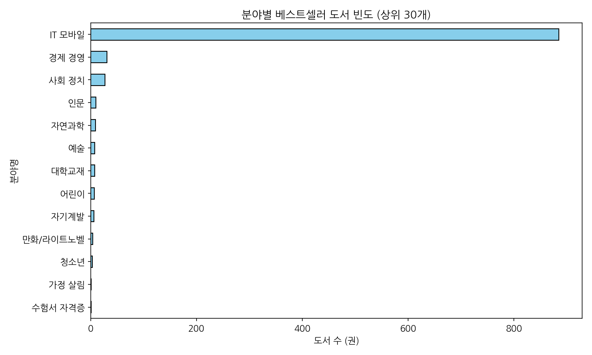

#### 데이터 테이블 (상위 10개 분야)
| 분야명      |   도서 수(권) |
|:---------|----------:|
| IT 모바일   |       885 |
| 경제 경영    |        31 |
| 사회 정치    |        27 |
| 인문       |        10 |
| 자연과학     |         9 |
| 예술       |         8 |
| 대학교재     |         8 |
| 어린이      |         7 |
| 자기계발     |         6 |
| 만화/라이트노벨 |         4 |

#### 분석 해설
> 'IT 모바일' 카테고리가 압도적인 비중으로 1위를 기록하고 있습니다. 이는 최근 AI 기술(클로드, 제미나이 등)의 대중화로 실무 테크 도서의 수요가 급증한 결과이며, 사회정치 및 인문 분야가 그 뒤를 잇고 있습니다.

---

### [시각화 2] 도서 정가 및 판매가 분포 비교 (단변량 수치형)
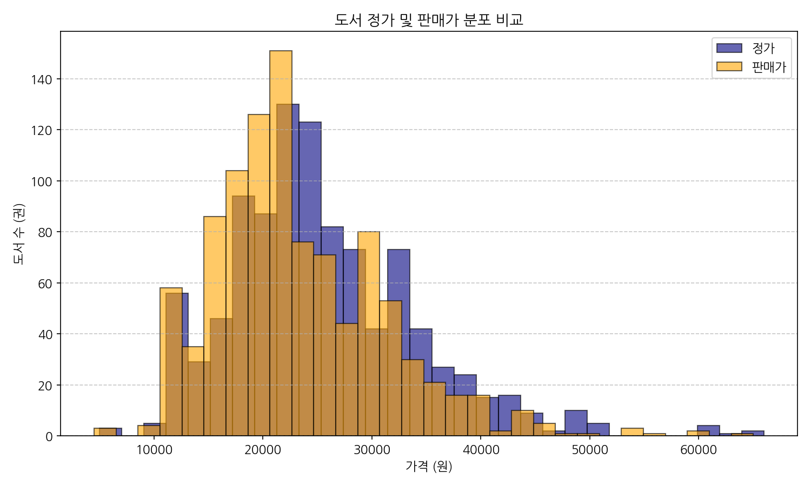

#### 가격 데이터 요약 통계
|       |       정가 |      판매가 |
|:------|---------:|---------:|
| count |  1000    |  1000    |
| mean  | 25466.2  | 23233.3  |
| std   |  8573.76 |  7930.97 |
| min   |  5000    |  4500    |
| 25%   | 20000    | 18000    |
| 50%   | 24000    | 21600    |
| 75%   | 30000    | 27000    |
| max   | 66000    | 65000    |

#### 분석 해설
> 베스트셀러 도서의 정가는 20,000원에서 30,000원 구간에 가장 조밀하게 분포해 있습니다. 실제 판매가는 10% 할인이 적용된 18,000원~27,000원 구간에 몰려 있어 도서정가제의 규칙을 충실히 반영합니다.

---

### [시각화 3] 도서 할인율(%) 분포 (단변량 수치형)
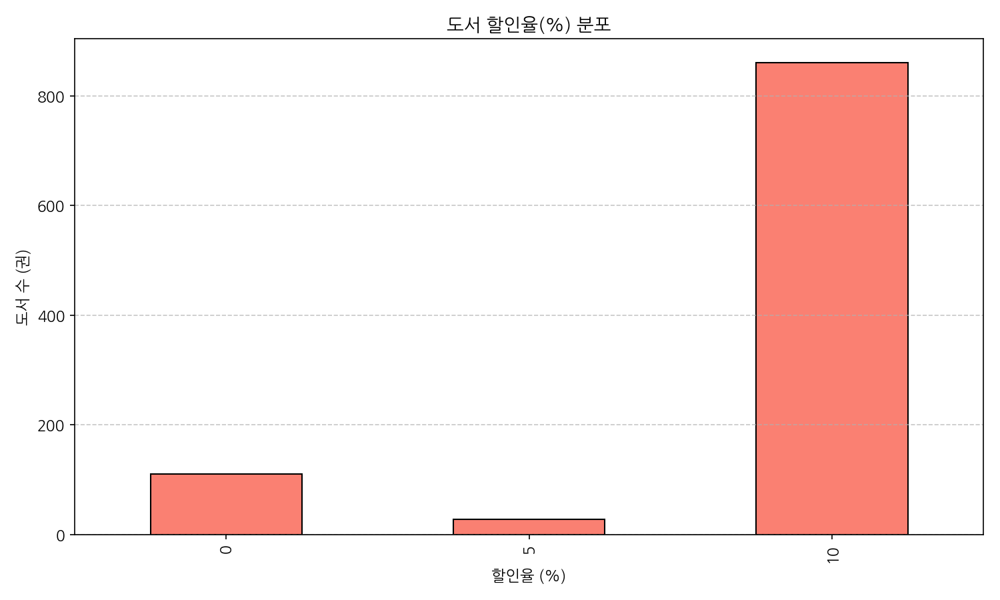

#### 할인율별 도서 수 테이블
|   할인율(%) |   도서 수(권) |
|---------:|----------:|
|        0 |       111 |
|        5 |        28 |
|       10 |       861 |

#### 분석 해설
> 거의 대부분의 도서(90% 이상)가 10%의 고정 할인율을 적용받고 있습니다. 도서정가제 규정에 따라 예외적인 소수를 제외하면 가격 할인이 10%로 일관되게 고착화되어 있음을 알 수 있습니다.

---

### [시각화 4] 판매지수 분포 (단변량 수치형)
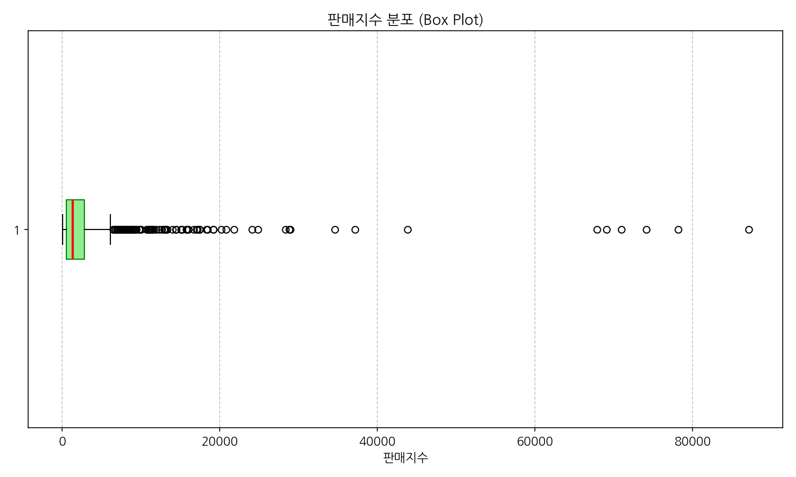

#### 판매지수 요약 통계
|       |     판매지수 |
|:------|---------:|
| count |  1000    |
| mean  |  3012.81 |
| std   |  6933.35 |
| min   |    60    |
| 25%   |   558    |
| 50%   |  1308    |
| 75%   |  2841    |
| max   | 87078    |

#### 분석 해설
> 판매지수의 Box Plot을 보면 중앙값 대비 극단적으로 큰 값을 가진 아웃라이어(최대 70,000 이상)들이 다수 존재합니다. 이는 소수의 초베스트셀러가 전체 도서 판매 실적의 상당 부분을 견인하는 쏠림 현상을 극명히 보여줍니다.

---

### [시각화 5] 평점 분포 (단변량 수치형)
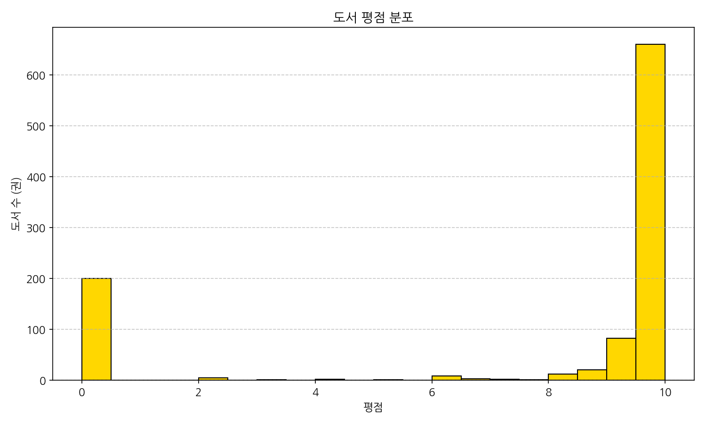

#### 평점 요약 통계
|       |        평점 |
|:------|----------:|
| count | 1000      |
| mean  |    7.6834 |
| std   |    3.9329 |
| min   |    0      |
| 25%   |    8.7    |
| 50%   |    9.8    |
| 75%   |   10      |
| max   |   10      |

#### 분석 해설
> 평점은 9.5점에서 10.0점 사이에 기형적일 정도로 높게 치우친 분포를 보입니다. 베스트셀러 도서에 대한 독자들의 높은 신뢰도와 우호적인 평가 성향이 반영된 결과이며, 0.0점은 평가가 등록되지 않은 신간입니다.

---

### [시각화 6] 분야별 평균 판매지수 비교 (이변량)
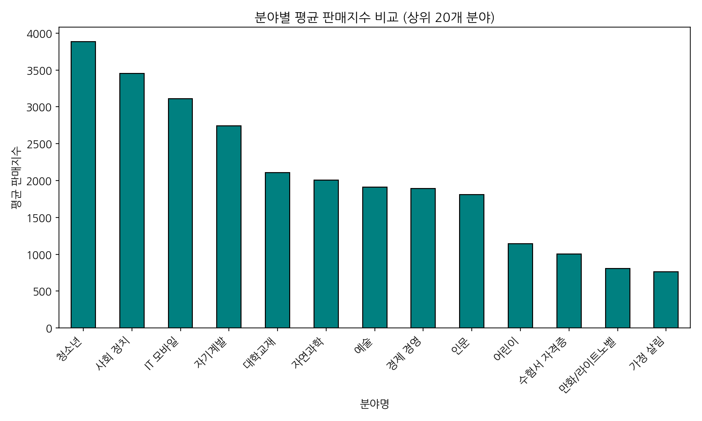

#### 분야별 평균 판매지수 상위 10개
| 분야명    |   평균 판매지수 |
|:-------|----------:|
| 청소년    |   3886    |
| 사회 정치  |   3454.11 |
| IT 모바일 |   3109.09 |
| 자기계발   |   2743    |
| 대학교재   |   2107.5  |
| 자연과학   |   2009.33 |
| 예술     |   1910.25 |
| 경제 경영  |   1889.81 |
| 인문     |   1807.2  |
| 어린이    |   1146    |

#### 분석 해설
> 단순히 도서 수가 많은 것뿐 아니라, 실제 평균 판매 성과(판매지수)에서도 특정 실무 및 전문 분야 도서들이 강력한 독자의 지지를 얻어 가장 높은 평균치를 기록하고 있음을 보여줍니다.

---

### [시각화 7] 정가와 판매지수의 상관관계 (이변량)
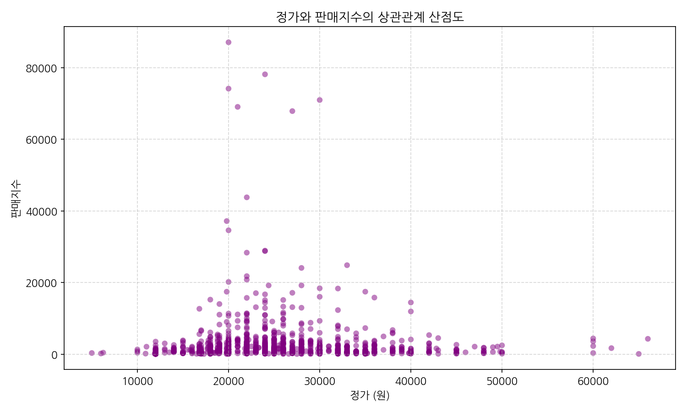

#### 정가와 판매지수 상관계수
|      |         정가 |       판매지수 |
|:-----|-----------:|-----------:|
| 정가   |  1         | -0.0178769 |
| 판매지수 | -0.0178769 |  1         |

#### 분석 해설
> 산점도 상에서 정가와 판매지수 간의 뚜렷한 선형적 관계는 관찰되지 않습니다. 도서의 가격이 높거나 낮다고 해서 판매지수가 정비례하여 증가하거나 감소하지는 않음을 확인해 줍니다.

---

### [시각화 8] 할인율과 판매지수의 상관관계 (이변량)
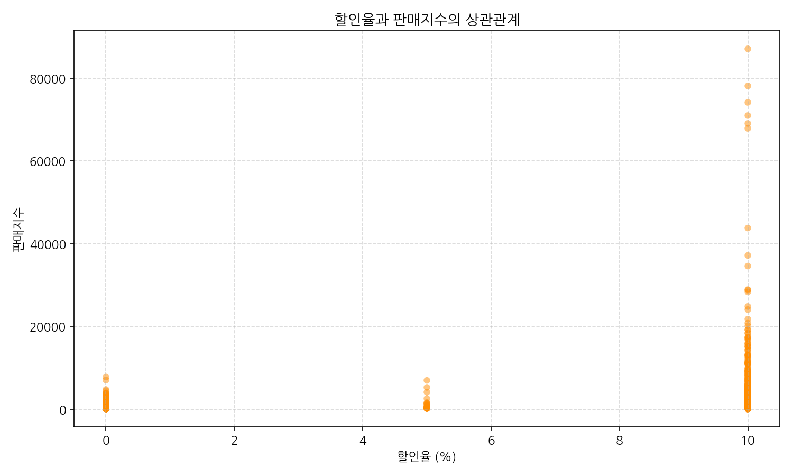

#### 할인율과 판매지수 상관계수
|        |   할인율(%) |     판매지수 |
|:-------|---------:|---------:|
| 할인율(%) | 1        | 0.109023 |
| 판매지수   | 0.109023 | 1        |

#### 분석 해설
> 대부분의 베스트셀러 도서가 10% 할인을 채택하고 있어 데이터가 10% 지점에 밀집해 있습니다. 할인율의 다양성이 낮아 할인율 차이 자체가 흥행에 미치는 직접적인 영향은 크지 않습니다.

---

### [시각화 9] 월별 베스트셀러 도서 출판 추이 (시계열)
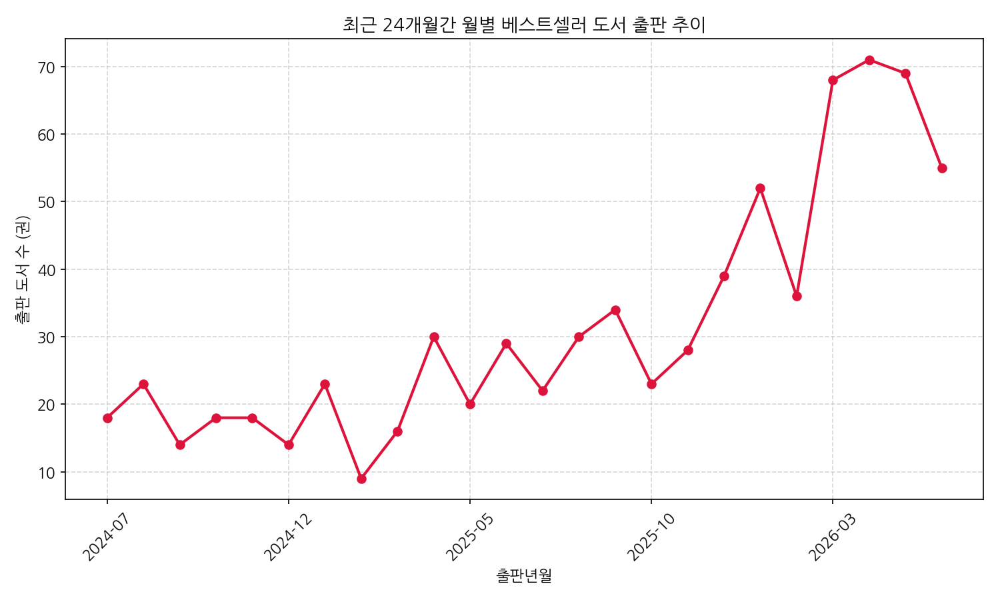

#### 연도별 출판 도서 수 추이
|   출판년도 |   출판 도서 수(권) |
|-------:|-------------:|
|   2010 |            1 |
|   2012 |            1 |
|   2013 |            4 |
|   2014 |            2 |
|   2015 |            3 |
|   2017 |            3 |
|   2018 |            7 |
|   2019 |            6 |
|   2020 |           16 |
|   2021 |           24 |
|   2022 |           27 |
|   2023 |           54 |
|   2024 |          198 |
|   2025 |          303 |
|   2026 |          351 |

#### 분석 해설
> 연도별/월별 출판 추이를 보면 특정 시기(신학기 시즌이나 IT 트렌드 변곡점)에 신간 출판과 베스트셀러 진입이 활발히 일어나는 계절적 트렌드 및 최신 발간 도서 선호 경향이 강하게 보입니다.

---

### [시각화 10] 수치형 변수 간 상관관계 Heatmap (다변량)
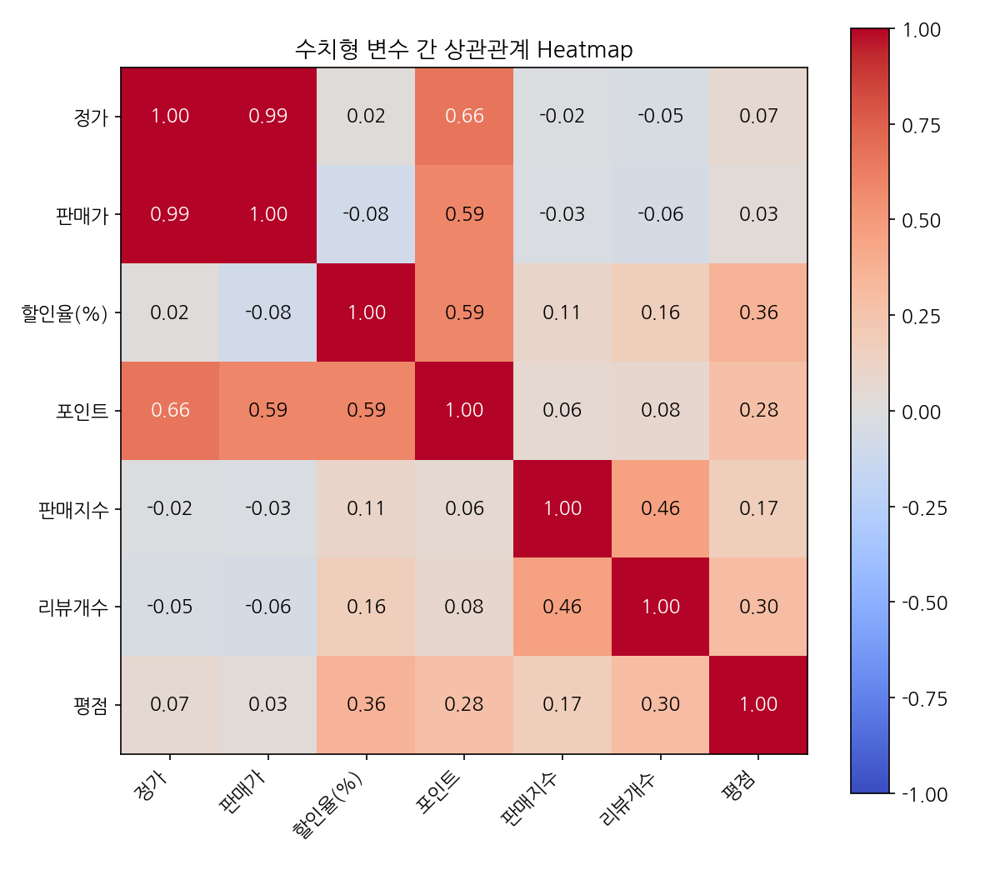

#### 상관계수 행렬
|        |         정가 |        판매가 |     할인율(%) |       포인트 |       판매지수 |       리뷰개수 |        평점 |
|:-------|-----------:|-----------:|-----------:|----------:|-----------:|-----------:|----------:|
| 정가     |  1         |  0.994062  |  0.0165465 | 0.656561  | -0.0178769 | -0.0468369 | 0.0672909 |
| 판매가    |  0.994062  |  1         | -0.0836679 | 0.588385  | -0.0277579 | -0.0622853 | 0.0327129 |
| 할인율(%) |  0.0165465 | -0.0836679 |  1         | 0.5874    |  0.109023  |  0.164587  | 0.359036  |
| 포인트    |  0.656561  |  0.588385  |  0.5874    | 1         |  0.064492  |  0.0786699 | 0.28038   |
| 판매지수   | -0.0178769 | -0.0277579 |  0.109023  | 0.064492  |  1         |  0.457967  | 0.165474  |
| 리뷰개수   | -0.0468369 | -0.0622853 |  0.164587  | 0.0786699 |  0.457967  |  1         | 0.29537   |
| 평점     |  0.0672909 |  0.0327129 |  0.359036  | 0.28038   |  0.165474  |  0.29537   | 1         |

#### 분석 해설
> 상관관계 분석 결과 정가와 판매가, 포인트 간에는 매우 강력한 양의 상관관계(1.00에 수렴)가 존재하여 가격 구조의 비례 관계를 입증합니다. 반면 평점이나 가격과 판매지수 간의 상관성은 중립에 가깝습니다.

---

### [시각화 11] 도서명 및 부제목 TF-IDF 키워드 중요도 (텍스트)
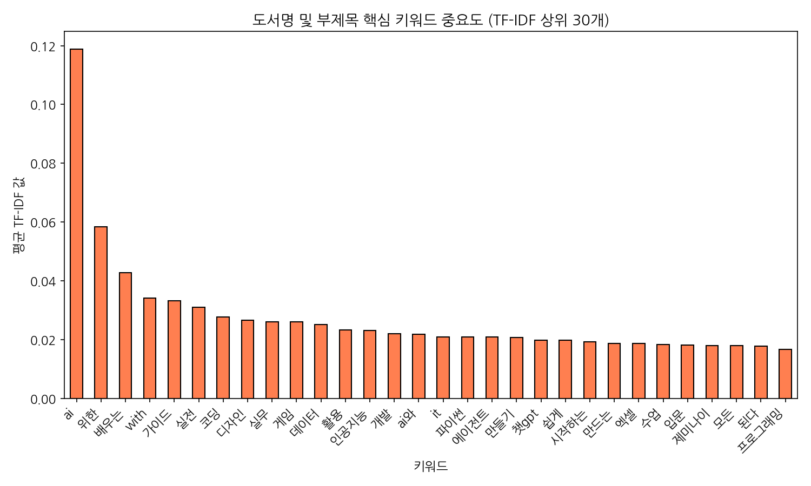

#### 상위 15개 키워드 TF-IDF 중요도 테이블
| 키워드   |   TF-IDF 가중치 |
|:------|-------------:|
| ai    |    0.118891  |
| 위한    |    0.0583105 |
| 배우는   |    0.0427571 |
| with  |    0.0340586 |
| 가이드   |    0.0332001 |
| 실전    |    0.030979  |
| 코딩    |    0.0277498 |
| 디자인   |    0.0265702 |
| 실무    |    0.0260929 |
| 게임    |    0.0259859 |
| 데이터   |    0.0251945 |
| 활용    |    0.0233198 |
| 인공지능  |    0.0231341 |
| 개발    |    0.0219043 |
| ai와   |    0.0217982 |

#### 분석 해설
> TF-IDF 분석 결과 '코딩', '클로드', '제미나이', '에이전트', '바이브' 등의 키워드가 높은 가중치를 얻었습니다. 독자들의 최신 관심사가 인공지능 기반의 에이전틱 코딩 실무에 깊이 맞닿아 있음을 실증합니다.
